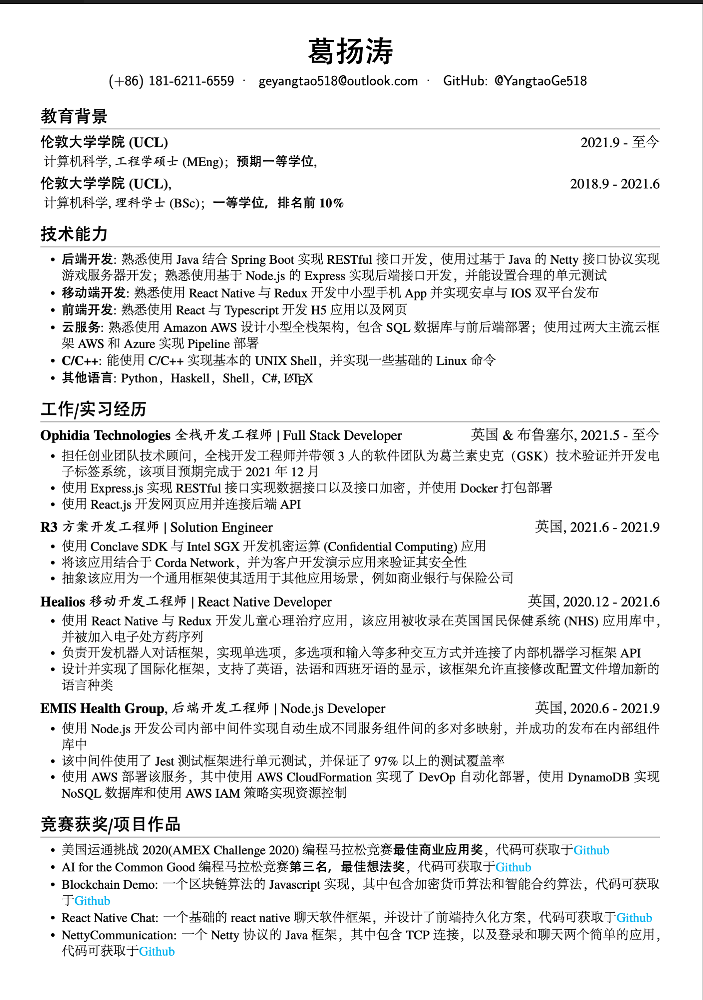

# 个人简历（中文）

本项目为个人中文简历 Latex 源码，同时包含效果图呈现，简历入口为 `resume-CN.tex`， 修改自项目 [resume from billray](https://github.com/billryan/resume/) 和 [resume from hijiangtao](https://github.com/hijiangtao/resume)

## 项目说明

一个优雅的 \LaTeX\ 简历模板, 使用 \XeLaTeX\ 编译, 由于使用到 `fontspec` 包，编译器需选择 XeLaTeX

## 特性

- 极其容易定制和扩展 (`res`模板中枪倒地...)
- 完善的 Unicode 字体支持, 因为用的是 \XeLaTeX\ 嘛
- 完美的中文支持，使用 Adobefonts
- 支持 FontAwesome 4.3.0 (目前还不支持使用别名)

### 效果输出



## 使用方法

1. OverLeaf 在线编译
2. 使用较新的 \LaTeX\ 发行版在本地计算机编译

```
git clone https://github.com/YangtaoGe518/Resume.git --branch master --depth 1 --single-branch <folder>
```

### 宏

- `\name`: 姓名
- `\contactInfo`: 联系信息, 需要三项信息，分别是{邮箱}{手机号}{个人主页}
- `\basicContactInfo`: 简要的联系信息, 需要 项信息, 分别是{邮箱}{手机号}, 没有个人主页的用这个
- `\section`: 用于分节, 如教育背景, 实习/项目经历等
- `\subsection`: 用于小节标题, 无日期选项
- `\datedsubsection`: 用于小节标题, 简历中使用最广，第二项为时间区间，自动右对齐
- `\itemize`: 清单列表，简历中应用最广
- `\enumerate`: 枚举列表，数字标号

### FontAwesome

首先在 [Font Awesome Icons](http://fortawesome.github.io/Font-Awesome/icons/) 上选中自己想使用的图标(暂不支持 alias)，然后在 [fontawesome.sty](https://github.com/billryan/resume/blob/zh_CN/fontawesome.sty) 中找到相应的宏, 将其作为普通文本一样使用。

其他的可以自行参考相应 cls 和 tex 文件。

## License

[The MIT License (MIT)](http://opensource.org/licenses/MIT)

Copyrighted fonts are not subjected to this License.
